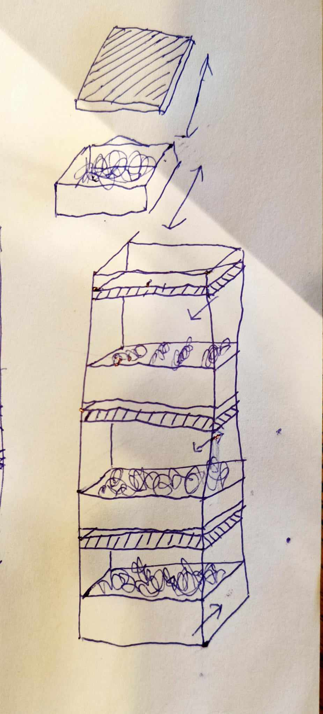

# Brainstorming (16 October)

## Starting up the old system
- drainage tubes have to be fixed
- relays have to be changed for better ones
- the substrate (rock wool) should be changed for new substrate (we might have to try a different type of substrate)
- fix the water replacement issue (easier access)

## Our ideas for the new system, modularity
We will make something to put in your home (kitchen) instead of an Industrial scale farm. Not every home is the same, that's why our system should be modular.
Our system is based on hydroponics.
- a system with drawers inside drawers

- connecting the sensors via I2C bus, having single common rail for all modules
- Plug & Play system for every module

## Plans for our next session
- getting the system running