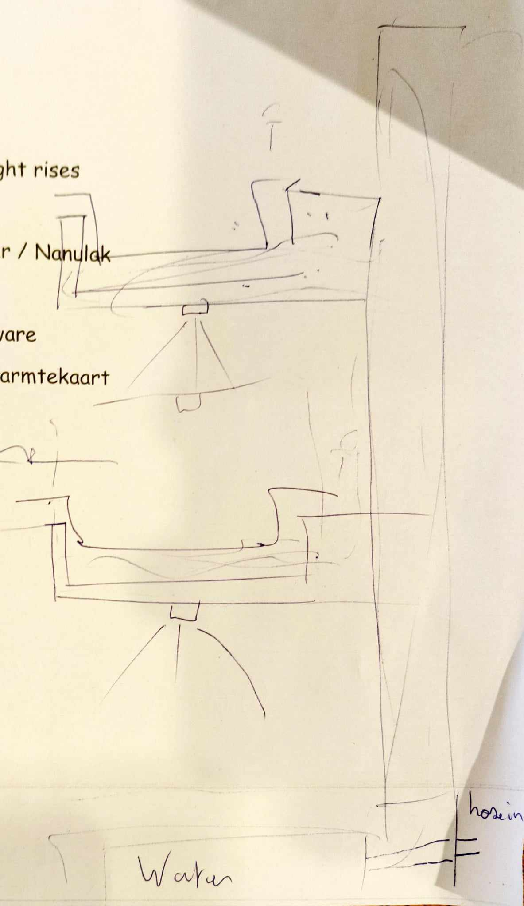
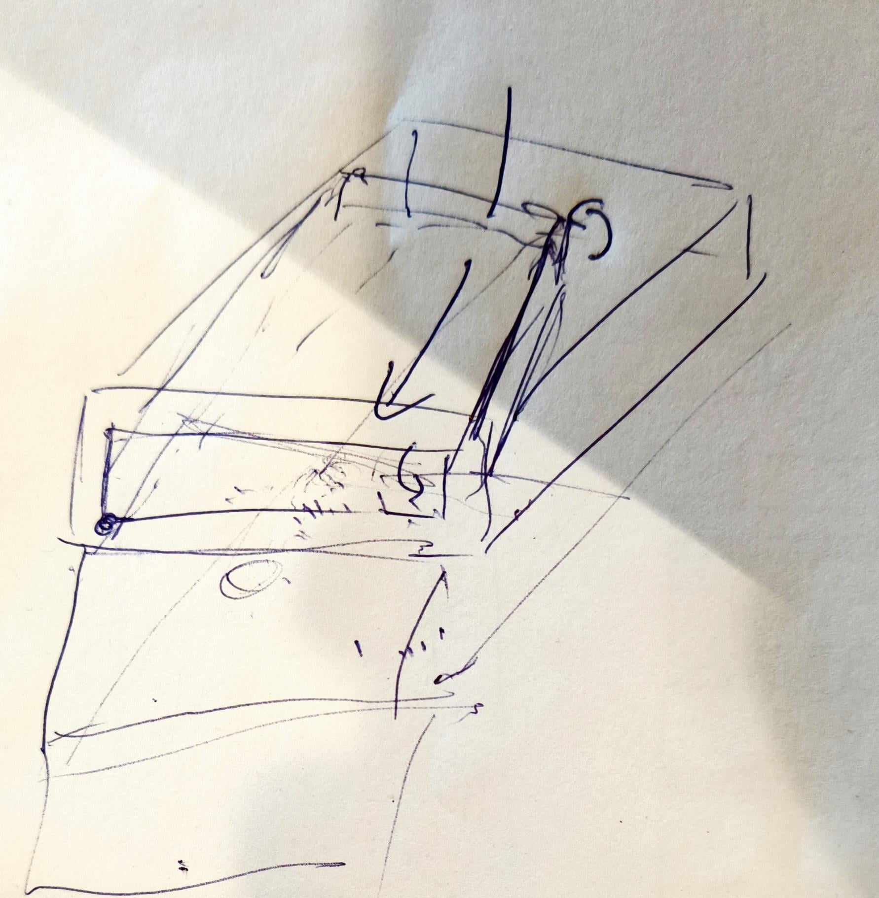

# 🌱 Vertical Farm Project "Plan-T" Logboek

## 📅 18-03-2025: De echte constructie komt dichterbij!
- **Team Plantenbak**: 
Naar de Action om verf, borstels en andere benodigdheden. 
- **Team Water**: 
Kallibratie van de ion-sensoren nagekeken.
YAML-code afgewerkt
- **Team Licht**: 

<!-- Eerst vertalen, dan aanvullen, bewerken-->

---

## 📅 15-03-2025: Wachten op bestellingen & voorbereiden opendeurdag
Met de meeste componenten besteld en Mr. Coppens die aan de kast werkt, werken wij aan:
- Het testen van sensoren, ESP's en YAML-code.
- Het zoeken naar bijkomende materialen: witte verf, verfborstels, kokosvezels, etc.

---

## 📅 11-03-2025: PCB's besteld! 🎉
De PCB's zijn besteld bij **PCBWay**.

---

## 📅 06-03-2025: Eerste zaaisel! 🌱
We zaaiden onze eerste zaadjes als een referentie, of misschien wel om ze binnenkort in onze werkende vertical farm te verpotten! 
### 🌿 Geplant:
- Basilicum
- Koriander
- Munt
- Oregano
- Bladsla

Bijkomend hebben we, **de oude constructie afgebroken**.

---

## 📅 25-02-2025: Eerste bestelling geplaatst! 🛒
We bestelden meerdere benodigde componenenten voor onze constructie.
### 📦 Gebruikte websites:
- Mouser
- RS Components
- TinyTronics
- PCBWay
- AliExpress

---

## 📅 Eerste maand van de tweede semester: De voorbereiding begint
Iedere groep (Team Plantenbak, Team Licht, Team Water) zijn begonnen met onderzoek en het ontwerpen van hun systemen. 
- We **hergebruikten zoveel mogelijk componenten** van de oude constructie.

---

## 📅 17-12-2024: Presentatie & feedback
We stelden onze vooruitgang voor en vergaarden feedback in onze **ClickUp notities**.

---

## 📅 19-11-2024: Planning fase 📝
Wachtende op onze **PCB's** hebben we:
- Een planning gemaakt
- Een taakverdeling gemaakt

---

## 📅 22-10-2024: Werken aan het oude systeem ⚙️
We verzamelden om het vorige systeem te **analyzeren en herstarten**.

<!-- Dit lijkt een deel appart -->

### 🔌 Opstarten van het systeem
Gebruik makende van [deze handleiding](https://verticalfarmib3.github.io/inhoud/operation/), hebben we alles ingeschakeld:
- **ESPHome server** draait op `192.168.0.40:8123` van het CM3-netwerk. <!-- CM3-->
- **Grafana interface** is bereikbaar via poort `3000`.
- **Licht, pompen, ventilatoren en de mixer** zijn succesvol getest.
- **Automatisering** verzekert het in- en uitschakelen van het licht op de juiste ogenblikken.

### 📦 De constructie herlocaliseren
1. Verwijderen van de **houten constructie**.
2. Het **glazen paneel** uit elkaar gehaald.
3. Het schoonmaken van **de oude planten en het interieur**.
4. Verplaatsen van het **houten frame**.
5. Installeren van het **aluminum frame**.

### 🌱 Nieuwe zaadjes
We plantte verze zaadjes:
- Basilicum
- Dille
- Bieslook
- Oregano
- Peterselie
- Afrikaanse goudsbloemen

📌 **Geupdated lichttiming**: **08:00 - 20:00**
📌 **Geupdated ventilatortiming**: **5 minuten elke 30 minuten**

### ❌ Gevonden problemen
- ⚠️ De mixer werkt slechts **enkele seconden** aan een stuk.
- ⚠️ **De drainage verstopt** door de rotswol.
- ⚠️ **Hetelijm was gebruikt** in de plaats van waterbestendige silicone.
- ⚠️ **Hoge opstartstroom** zorgt voor het aan elkaar lassen van de relayscontacten.
- ⚠️ **Kapotte vochtsensoren** leiden tot overbewatering en lekken.

---

## 📅 16-10-2024: Brainstorming 💡
### 🔄 Herstellen van het oude systeem
- **Vervangen van de drainage**.
- **Upgraden van de relays**.
- **Test van alternatieve substraten**.
- **Verbeteren van waterafvoer**.

### 🏡 Nieuw systeem: Focus op modulariteit
We mikken op het **ontwerpen van een huisvriendelijke vertical farm**, geen industrieel ontwerp. Ons systeem moet **modulair** zijn.
- **Lade gebaseerd systeem** in een andere lade.
- **Sensoren geconnecteerd via de I2C bus**. <!---->
- **Gemeenschappelijke voedingsmodule** voor alle modules.
- **Plug & Play systeem** voor een makkelijke setup.

### 📅 Doel van de volgende sessie
- Het opstarten van het oude systeem.

---

## 📸 Concepttekeningen

  
  
  

<!-- Komt er nog ergens een verklarende woordenlijst?-->