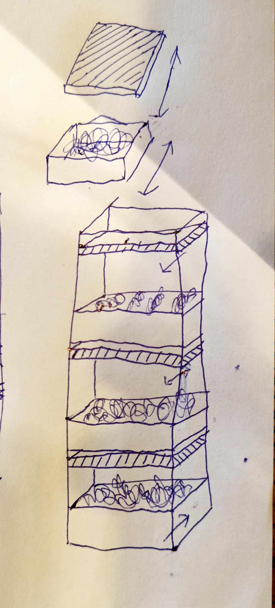

# 🌱 Vertical Farm Project "Plan-T" Logboek

<!-- Beetje kijken met alle groepen hoe we de planning etc doen -->

## 📅 12-05-2025:
- **Team Water**: 

---

## 📅 06-05-2025: 
- **Team Water**: 

---

## 📅 29-04-2025:
- **Team Water**: 

---

## 📅 22-04-2025:
- **Team Water**: 

---

## 📅 07-04-2025 tot 20-04-2025:
- **Team Water**: 
-	Verder gewerkt aan afvoer: montage + boren regenpijp
-	Gekeken naar buitenkast
-	Nagemeten kapotte probe
-	Test op lekkages + lekken opgelost
-	Waterproofen
-	Hoogtesensoren verbonden en gekalibreerd
-	Houder voor middelste hoogtesensor ontworpen
-	Kabels in hulzen gestoken
-	Kraantjeswater en voedingsstoffen uitgemeten
-	Reservoirs gevuld, pompjes getest, mixer getest, circulatie getest

---

## 📅 04-04-2025:
- **Team Water**: 
-	Nagekeken realisatie buitenkast

---

## 📅 01-04-2025:
- **Team Water**: 
-	Chemische probes gekalibreerd
-	Stroomsensor geherkalibreerd
-	Documentatie kalibraties op Github aangevuld
-	Probes, pompjes, tubes gemonteerd en verbonden
-	Hoogtesensoren gemonteerd
-	Afvoeren in plantenlades bevestigd
-	Kast verder bijgewerkt

---

## 📅 26-03-2025: 
- **Team Water**: 
-	Ultrasone sensor houders
-	PCB programmeren en verbinden met HomeAssistant

---

## 📅 25-03-2025:
- **Team Water**: 
-	Verder gewerkt aan kast (indeling uitgewerkt, laden gerepareerd, …)
-	Materiaal gekocht in de Gamma
-	Oude profielen uit elkaar gehaald en nieuwe profielen in elkaar gezet
-	Plantenbakken hellend gemaakt
-	Uitgedacht la layout …
-	PCB gesoldeerd
-	Probehouder ontworpen en geprint

---

## 📅 21-03-2025:
- **Team Water**: 
-	Kast afgewerkt met team licht
-	Kast verplaatst naar B225

---

## 📅 20-03-2025:
- **Team Water**: 
-	Chemie: kalibratievloeistoffen gemaakt

---

## 📅 18-03-2025: De echte constructie komt dichterbij!
- **Team Plantenbak**: 
Naar de Action om verf, borstels en andere benodigdheden. 
- **Team Water**: 
- Kallibratie van de ion-sensoren nagekeken.
- YAML-code afgewerkt
-	Afgewerkt kastframe met team plantenbak
- Stroomsensoren
- **Team Licht**: 

---

## 📅 15-03-2025: Wachten op bestellingen & voorbereiden opendeurdag
Met de meeste componenten besteld en Mr. Coppens die aan de kast werkt, werken wij aan:
- Het testen van sensoren, ESP's en YAML-code.
- Het zoeken naar bijkomende materialen: witte verf, verfborstels, kokosvezels, etc.

- **Team Water**: 
-	Lamp testen 
-	Bekijken wat nodig voor chemie
-	Verder werken aan YAML-code voor elektronica

---

## 📅 13-03-2025:
- **Team Water**: 
-	Overleg met chemie (meneer De Vreese)

---

## 📅 11-03-2025: PCB's besteld! 🎉
De PCB's zijn besteld bij **PCBWay**.

- **Team Water**: 
-	UV-lamp testen, elektronische componenten testen
-	Elektronische componenten testen
-	PCB-componenten gecontroleerd en PCB besteld
-	Pinout voor PCB beschreven
-	YAML voor watersysteem gestart
-	Gewerkt aan opbouw kast met team plantenbak

---

## 📅 06-03-2025: Eerste zaaisel! 🌱  <!-- 06/03 of 04/03? -->
We zaaiden onze eerste zaadjes als een referentie, of misschien wel om ze binnenkort in onze werkende vertical farm te verpotten! 
### 🌿 Geplant:
- Basilicum
- Koriander
- Munt
- Oregano
- Bladsla

Bijkomend hebben we, **de oude constructie afgebroken**.

---

## 📅 04-03-2025:
- **Team Water**: 
-	Elektrisch schema afgemaakt
-	PCB maken gestart
-	Afbreken en recycleren oud systeem met team plantenbak
-	Bedrijfsbezoek Citymesh

---

## 📅 25-02-2025: Eerste bestelling geplaatst! 🛒
We bestelden meerdere benodigde componenenten voor onze constructie.
### 📦 Gebruikte websites:
- Mouser
- RS Components
- TinyTronics
- PCBWay
- AliExpress

- **Team Water**: 
-	Elektrisch schema verder afwerken
-	Componenten besteld
-	Bedrijfsbezoek Colruyt

---

## 📅 18-02-2025:
- **Team Water**: 
-	Afronden bestellijst en opsturen 
-	Voeding voor elektronica bepaald
-	Onderzoek naar ADC voor de chemische probes
-	Start elektrisch schema PCB
-	Volgens mij was hier afwerken planning...
-	Uitwerken toevoer/afvoer

---

## 📅 11-02-2025:
- **Team Water**: 
-	Teamverdeling schakels (+ herverdeling) + inlichten
-	Opstellen taakverdeling
-	Afwerken planning 
-	Besluiten welk systeem te gebruiken 
-	Bestellijst aanvullen

---

<!-- Dit lijkt een deel appart -->

## 📅 Eerste maand van de tweede semester: De voorbereiding begint
Iedere groep (Team Plantenbak, Team Licht, Team Water) zijn begonnen met onderzoek en het ontwerpen van hun systemen. 
- We **hergebruikten zoveel mogelijk componenten** van de oude constructie.

---

## 📅 17-12-2024: Presentatie & feedback
We stelden onze vooruitgang voor en vergaarden feedback in onze **ClickUp notities**.

---

## 📅 19-11-2024: Planning fase 📝
Wachtende op onze **PCB's** hebben we:
- Een planning gemaakt
- Een taakverdeling gemaakt

---

## 📅 22-10-2024: Werken aan het oude systeem ⚙️
We verzamelden om het vorige systeem te **analyzeren en herstarten**.

### 🔌 Opstarten van het systeem
Gebruik makende van [deze handleiding](https://verticalfarmib3.github.io/inhoud/operation/), hebben we alles ingeschakeld:
- **ESPHome server** draait op `192.168.0.40:8123` van het CM3-netwerk. <!-- CM3-->
- **Grafana interface** is bereikbaar via poort `3000`.
- **Licht, pompen, ventilatoren en de mixer** zijn succesvol getest.
- **Automatisering** verzekert het in- en uitschakelen van het licht op de juiste ogenblikken.

### 📦 De constructie herlocaliseren
1. Verwijderen van de **houten constructie**.
2. Het **glazen paneel** uit elkaar gehaald.
3. Het schoonmaken van **de oude planten en het interieur**.
4. Verplaatsen van het **houten frame**.
5. Installeren van het **aluminum frame**.

### 🌱 Nieuwe zaadjes
We plantte verze zaadjes:
- Basilicum
- Dille
- Bieslook
- Oregano
- Peterselie
- Afrikaanse goudsbloemen

📌 **Geupdated lichttiming**: **08:00 - 20:00**
📌 **Geupdated ventilatortiming**: **5 minuten elke 30 minuten**

### ❌ Gevonden problemen
- ⚠️ De mixer werkt slechts **enkele seconden** aan een stuk.
- ⚠️ **De drainage verstopt** door de rotswol.
- ⚠️ **Hetelijm was gebruikt** in de plaats van waterbestendige silicone.
- ⚠️ **Hoge opstartstroom** zorgt voor het aan elkaar lassen van de relayscontacten.
- ⚠️ **Kapotte vochtsensoren** leiden tot overbewatering en lekken.

---

## 📅 16-10-2024: Brainstorming 💡
### 🔄 Herstellen van het oude systeem
- **Vervangen van de drainage**.
- **Upgraden van de relays**.
- **Test van alternatieve substraten**.
- **Verbeteren van waterafvoer**.

### 🏡 Nieuw systeem: Focus op modulariteit
We mikken op het **ontwerpen van een huisvriendelijke vertical farm**, geen industrieel ontwerp. Ons systeem moet **modulair** zijn.
- **Lade gebaseerd systeem** in een andere lade.
- **Sensoren geconnecteerd via de I2C bus**. <!---->
- **Gemeenschappelijke voedingsmodule** voor alle modules.
- **Plug & Play systeem** voor een makkelijke setup.

### 📅 Doel van de volgende sessie
- Het opstarten van het oude systeem.

---

## 📸 Concepttekeningen

  
  
  

<!-- Komt er nog ergens een verklarende woordenlijst?-->