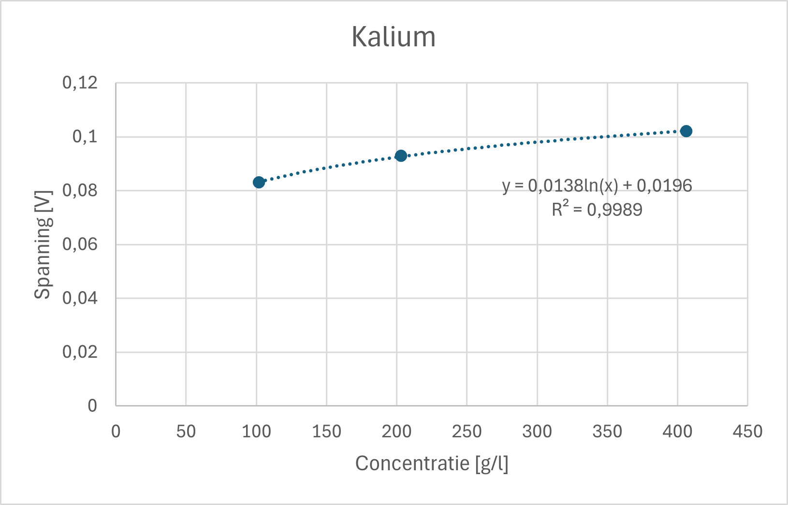
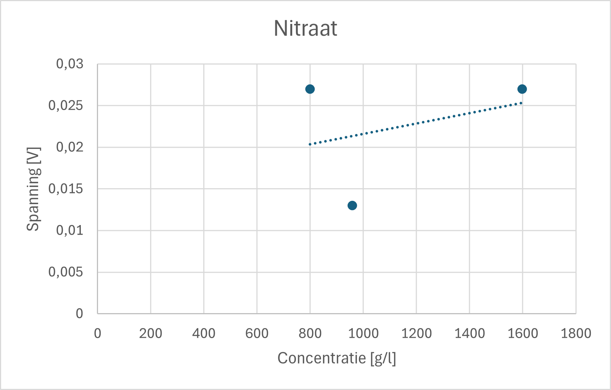

# Chemie Kalibratievloeistoffen

We maken stockoplossingen met de volgende concentraties:

| Ion  | Calibration Salt      | Desired Ion Concentration (g/l) | Desired Salt Concentration (g/l) | Measured Salt Concentration (g/l) | Actual Ion Concentration (g/l) |
|------|----------------------|--------------------------------|---------------------------------|-----------------------------------|--------------------------------|
| NO₃⁻ | NaNO₃               | 16                             | 21.93                           | 21.90                             | 15.98                          |
| Ca²⁺ | Ca(NO₃)₂4H₂O       | 2                              | 11.7845                         | 11.786                            | 2.00                            |
| K⁺   | KOH                 | 2                              | 2.8699                          | 2.915                             | 2.03                            |

Om de kalibratieoplossingen te maken, voegen we gedestilleerd water toe aan de stockoplossingen om drie verschillende ionconcentraties te bereiken. Deze drie waarden bestrijken het verwachte bereik dat door de sensoren wordt gebruikt.

| Ion   | Parts Stock Solution | Addition for High | Addition for Medium | Addition for Low |
|-------|----------------------|-------------------|---------------------|-----------------|
| NO₃⁻  | 1 part               | 9 parts H₂O      | 15.67 parts H₂O     | 19 parts H₂O   |
| Ca²⁺  | 1 part               | 4 parts H₂O      | 9 parts H₂O         | 19 parts H₂O   |
| K⁺    | 1 part               | 4 parts H₂O      | 9 parts H₂O         | 19 parts H₂O   |

### Absolute Hoeveelheden voor 200 ml Kalibratievloeistof

| Ion   | High (ml stock + ml H₂O) | Medium (ml stock + ml H₂O) | Low (ml stock + ml H₂O) |
|-------|-------------------------|---------------------------|-------------------------|
| NO₃⁻  | 10ml stock + 90ml H₂O  | 6ml stock + 94ml H₂O     | 10ml stock + 190ml H₂O  |
| Ca²⁺  | 20ml stock + 80ml H₂O  | 10ml stock + 90ml H₂O    | 10ml stock + 190ml H₂O  |
| K⁺    | 20ml stock + 80ml H₂O  | 10ml stock + 90ml H₂O    | 10ml stock + 190ml H₂O  |

Dit komt overeen met de onderstaande concentraties. Hiermee kalibreren we onze sensoren zodra de PCB is gemaakt.

| Ion   | Calibration Salt | Low (mg/l) | Medium (mg/l) | High (mg/l) |
|-------|----------------|------------|--------------|-------------|
| NO₃⁻  | NaNO₃         | 799        | 959          | 1598        |
| Ca²⁺  | Ca(NO₃)₂4H₂O | 100        | 200          | 400         |
| K⁺    | KOH          | 102        | 203          | 406         |

## Kalibratie per Sensor

De sensoren werden uitgelezen na enige tijd ondergedompeld te zijn in de kalibratievloeistoffen. We maten pas deze uitgansspanning nadat de meetwaarde gestabiliseerd werd.

### Kalibratie van de K⁺-sensor

| K⁺ Concentratie (mg/l) | Gemeten Spanning (V) |
|------------------------|----------------------|
| 406                    | 0.102                |
| 203                    | 0.093                |
| 102                    | 0.083                |

Na zo'n tien tot twintig seconden waren de metingen stabiel. We verkrijgen een nagenoeg perfect logaritmisch verband na het uitvoeren van regressie op deze meetwaarden.

### Kalibratie van de Ca²⁺-sensor

| Ca²⁺ Concentratie (mg/l) | Gemeten Spanning (V) |
|--------------------------|----------------------|
| 400                      | 0.044                |
| 200                      | 0.038                |
| 100                      | 0.032                |

Na zo'n tien seconden waren de metingen stabiel. We verkrijgen een nagenoeg perfect logaritmisch verband na het uitvoeren van regressie op deze meetwaarden.

### Kalibratie van de NO₃⁻-sensor

| NO₃⁻ Concentratie (mg/l) | Gemeten Spanning (V) |
|--------------------------|----------------------|
| 1598                     | 0.027                |
| 959                      | 0.013                |
| 799                      | 0.027                |

De kalibratie van nitraat werd tweemaal nagemeten, we verkregen echter geen interpreteerbare metingen. We vermoeden dat de probe kapot is, vorig jaar werd hier echter wel een logaritmisch verband gevonden.

## Uitmeten van de voedingsstoffen

Wanneer we het systeem volledig uittesten (vermoedelijk na de paasvakantie) zullen we de nutriëntverhouding kunnen uitmeten van de voedingsstoffen. Deze voedingsstoffen worden kant-en-klaar aangekocht in een tuincentrum. Dit ligt in lijn met het doel om de verticale farm commercieel op de markt te brengen, de voedingsstoffen zijn voor iedereen verkrijgbaar en kosten niet veel.

kraantjeswater:  
200mg/l Calcium  
1300mg/l Kalium

1/20 verdunde oplossing van voedingsstoffen:  
3mg/l Calcium  
7000mg/l Kalium
