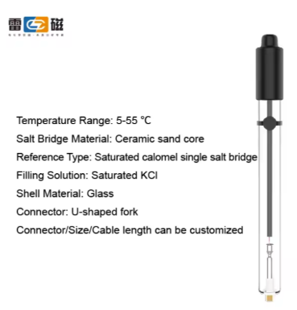
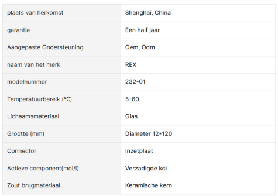
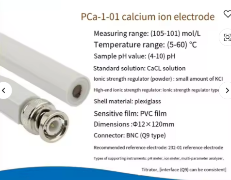
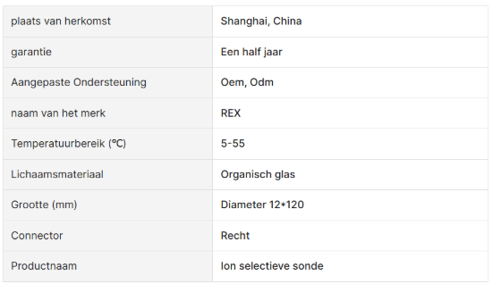
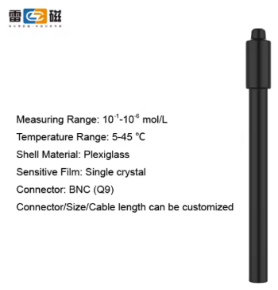
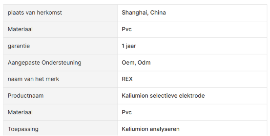
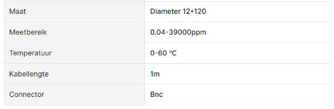
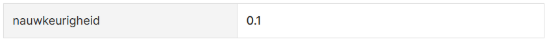
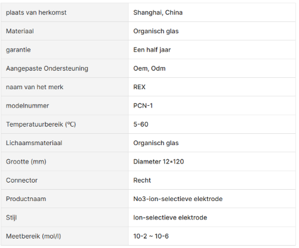

# Probes en hun belangrijkste kenmerken

## 232-01 Referentie-Elektrode Glazen Schaal Enkele Zoutbrug Referentiesonde Sensor:
Link: [232-01 Referentie-elektrode Glazen Schaal Enkele Zoutbrug Referentiesonde Sensor - Buy Reference Electrode Product on Alibaba.com](https://www.alibaba.com/product-detail/232-01-Reference-Electrode-Glass-Shell_60668853882.html?spm=a2756.order-detail-ta-ta-b.0.0.58caf19cLXQOM1)

### Belangrijkste kenmerken
#### Andere specificaties

## PCa-1-01 Calciumion Selectieve Sonde Isode Ca + Sensor
Link: [Pca-1-01 Calciumion Selectieve Sonde Isode Ca + Sensor - Buy Ion Selective Probe,Calcium Ion Selective Probe,Ion Selective Probe Product on Alibaba.com](https://www.alibaba.com/product-detail/PCa-1-01-Calcium-Ion-Selective_60659669573.html?spm=a2756.order-detail-ta-ta-b.0.0.58caf19cLXQOM1)

### Belangrijkste kenmerken
#### Andere specificaties

## Ise K + Kalium Ion Selectieve Elektrode Bnc Connector Laboratorium En Gebruik Voor Waterkwaliteit Detectie Kalium Test Px Meter

Link: [Ise K + Kalium Ion Selectieve Elektrode Bnc Connector Laboratorium En Gebruik Voor Waterkwaliteit Detectie Kalium Test Px Meter - Buy Potassium ion Selective electrode Product on Alibaba.com](https://www.alibaba.com/product-detail/ISE-K-Potassium-Ion-Selective-Electrode_1600225607843.html?spm=a2756.order-detail-ta-ta-b.0.0.58caf19cLXQOM1)

### Belangrijkste kenmerken
#### Andere specificaties

## Nitraat Ion-Selectieve Elektrode No3-Ise Sonde Nitraat Ionen Verbindingen Algemene Water Test Bnc Connector

Link: [Nitraat Ion-selectieve Elektrode No3-ise Sonde Nitraat Ionen Verbindingen Algemene Water Test Bnc Connector - Buy Ion-selective Electrode no3- Ise Probe nitrate Ions Compounds Product on Alibaba.com](https://www.alibaba.com/product-detail/Nitrate-Ion-selective-Electrode-NO3-ISE_60817798149.html?spm=a2756.order-detail-ta-ta-b.0.0.58caf19cjuoxNt)

### Belangrijkste kenmerken
#### Andere specificaties

Nauwkeurigheid: 0.01
