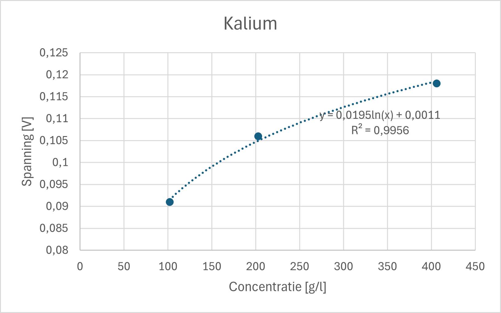
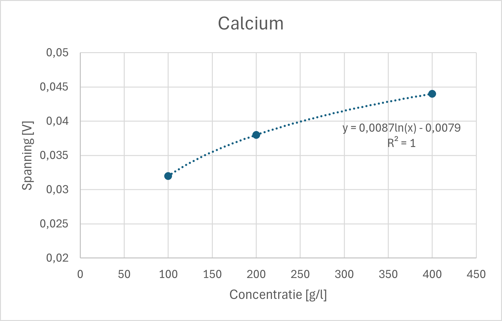

# Chemie Kalibratievloeistoffen

We maken stockoplossingen met de volgende concentraties:

| Ion  | Calibration Salt      | Desired Ion Concentration (g/l) | Desired Salt Concentration (g/l) | Measured Salt Concentration (g/l) | Actual Ion Concentration (g/l) |
|------|----------------------|--------------------------------|---------------------------------|-----------------------------------|--------------------------------|
| NO₃⁻ | NaNO₃               | 16                             | 21.93                           | 21.90                             | 15.98                          |
| Ca²⁺ | Ca(NO₃)₂4H₂O       | 2                              | 11.7845                         | 11.786                            | 2.00                            |
| K⁺   | KOH                 | 2                              | 2.8699                          | 2.915                             | 2.03                            |

Om de kalibratieoplossingen te maken, voegen we gedestilleerd water toe aan de stockoplossingen om drie verschillende ionconcentraties te bereiken. Deze drie waarden bestrijken het verwachte bereik dat door de sensoren wordt gebruikt.

| Ion   | Parts Stock Solution | Addition for High | Addition for Medium | Addition for Low |
|-------|----------------------|-------------------|---------------------|-----------------|
| NO₃⁻  | 1 part               | 9 parts H₂O      | 15.67 parts H₂O     | 19 parts H₂O   |
| Ca²⁺  | 1 part               | 4 parts H₂O      | 9 parts H₂O         | 19 parts H₂O   |
| K⁺    | 1 part               | 4 parts H₂O      | 9 parts H₂O         | 19 parts H₂O   |

### Absolute Hoeveelheden voor Kalibratievloeistof

| Ion   | High (ml stock + ml H₂O) | Medium (ml stock + ml H₂O) | Low (ml stock + ml H₂O) |
|-------|-------------------------|---------------------------|-------------------------|
| NO₃⁻  | 10ml stock + 90ml H₂O  | 6ml stock + 94ml H₂O     | 10ml stock + 190ml H₂O  |
| Ca²⁺  | 20ml stock + 80ml H₂O  | 10ml stock + 90ml H₂O    | 10ml stock + 190ml H₂O  |
| K⁺    | 20ml stock + 80ml H₂O  | 10ml stock + 90ml H₂O    | 10ml stock + 190ml H₂O  |

Dit komt overeen met de onderstaande concentraties. Hiermee kalibreren we onze sensoren zodra de PCB is gemaakt.

| Ion   | Calibration Salt | Low (mg/l) | Medium (mg/l) | High (mg/l) |
|-------|----------------|------------|--------------|-------------|
| NO₃⁻  | NaNO₃         | 799        | 959          | 1598        |
| Ca²⁺  | Ca(NO₃)₂4H₂O | 100        | 200          | 400         |
| K⁺    | KOH          | 102        | 203          | 406         |

### pH-waarden per kalibratievloeistof

| Ion   | Stock | High  | Medium | Low  |
|-------|-------|-------|--------|------|
| NO₃⁻  | 7     | 7     | 7      | 7    |
| Ca²⁺  | 6-7   | 6-7   | 6-7    | 6-7  |
| K⁺    | 12.7  | 12.0  | 11.7   | 11.4 |

## Kalibratie per Sensor

De sensoren werden uitgelezen na enige tijd ondergedompeld te zijn in de kalibratievloeistoffen. We maten pas deze uitgansspanning nadat de meetwaarde gestabiliseerd werd. Deze kalibraties werden twee keer uitgevoerd (met een week tussen beide kalibraties).

### Kalibratie van de K⁺-sensor

| K⁺ Concentratie (mg/l) | Gemeten Spanning kalibratie 1 (V) | Gemeten Spanning kalibratie 2 (V) |
|------------------------|----------------------|----------------------|
| 406                    | 0.102                | 0.118
| 203                    | 0.093                |0.106
| 102                    | 0.083                |0.091

  
  

Na zo'n tien tot twintig seconden waren de metingen stabiel. We verkrijgen een nagenoeg perfect logaritmisch verband na het uitvoeren van regressie op deze meetwaarden.

### Kalibratie van de Ca²⁺-sensor

| Ca²⁺ Concentratie (mg/l) | Gemeten Spanning kalibratie 1 (V) | Gemeten Spanning kalibratie 2 (V) |
|--------------------------|----------------------|----------------------|
| 400                      | 0.044                | 0.033
| 200                      | 0.038                | 0.028
| 100                      | 0.032                | 0.023

  
  

Na zo'n tien seconden waren de metingen stabiel. We verkrijgen een nagenoeg perfect logaritmisch verband na het uitvoeren van regressie op deze meetwaarden.

### Kalibratie van de NO₃⁻-sensor

| NO₃⁻ Concentratie (mg/l) | Gemeten Spanning kalibratie 1 (V) | Gemeten Spanning kalibratie 2 (V) |
|--------------------------|----------------------|----------------------|
| 1598                     | 0.027                | 0.0465
| 959                      | 0.013                | 0.0325
| 799                      | 0.027                | 0.018

  
  

Bij de eerste meting verkregen we geen verband tussen de meetwaarden. Bij de tweede meting was er wel een verband te vinden, maar de meetwaarden waren opmerkelijk laag vergeleken met de kalibraties die men vorig jaar uitvoerde.

### Kalibratie van de pH-sensor

| pH-waarde | Gemeten Spanning (V) |
|-----------|----------------------|
| 7         | 2.24
| 11.4      | 1.92
| 12        | 1.78

[pH-meting](./assets/Kalibratie_pH.png)

De pH-probe werd gekalibreerd met behulp van de eerder gemaakte kalibratievloeistoffen.

## Uitmeten van de voedingsstoffen

De voedingsstoffen worden kant-en-klaar aangekocht in een tuincentrum. Dit ligt in lijn met het doel om de verticale farm commercieel op de markt te brengen, de voedingsstoffen zijn voor iedereen verkrijgbaar en kosten niet veel.

kraantjeswater:  
200mg/l Calcium  
1300mg/l Kalium

1/20 verdunde oplossing van voedingsstoffen:  
3mg/l Calcium  
7000mg/l Kalium
