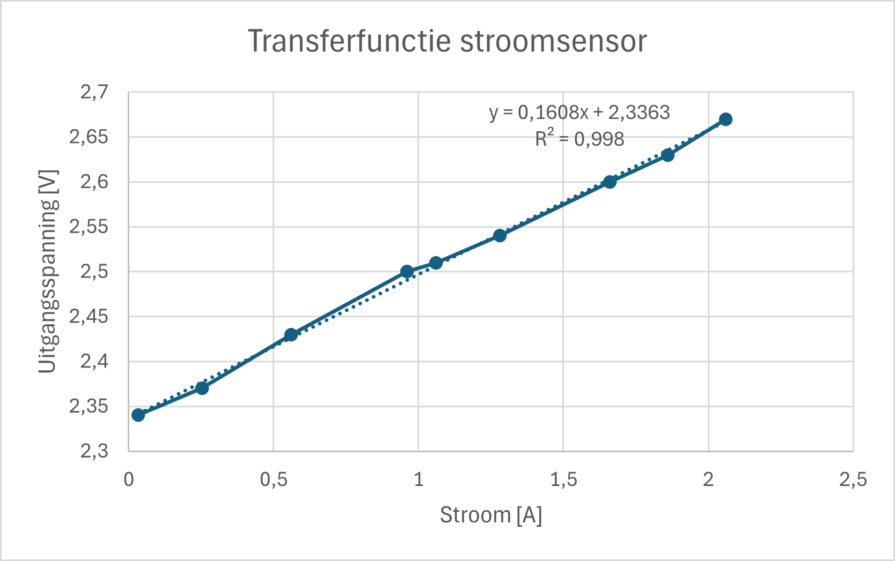

### Stroommeting - Berekende Resultaten

We meten het vermogen door de stroom te meten en deze te vermenigvuldigen met de spanning. De stroom wordt gemeten door een ACS712 sensor. Deze meet aan de hand van het Hall-effect een stroom tot 5 A. Wij zullen echter nooit een stroom van 3 A overtreffen (in uiterste gevallen). Om de analoge uitgangsspanning van deze sensor te beperken tot het bereik van de ADC van de ESP maken we gebruik van een spanningsdeler. Deze bestaat uit een 100k en een 10k weerstand.

We legden verschillende lasten aan om tot onderstaande gegevens te komen.

| Stroom (A) | Gemeten Spanning (V) | Voorspelde Stroom (A) | Afwijking (%) | Vermogen (W) | Opmerkingen |
|------------|----------------------|-----------------------|---------------|--------------|-------------|
| 0.032      | 2.34                 | 0.047                 | -46.88        | 0.56         | Grote afwijking bij lage stroom |
| 0.252      | 2.37                 | 0.231                 | 8.33          | 2.77         |             |
| 0.56       | 2.43                 | 0.598                 | -6.79         | 7.18         |             |
| 0.96       | 2.50                 | 1.026                 | -6.88         | 12.31        |             |
| 1.06       | 2.51                 | 1.088                 | -2.64         | 13.06        |             |
| 1.28       | 2.54                 | 1.271                 | 0.70          | 15.25        | Meest nauwkeurig |
| 1.66       | 2.60                 | 1.638                 | 1.33          | 19.66        |             |
| 1.86       | 2.63                 | 1.821                 | 2.10          | 21.85        |             |
| 2.06       | 2.67                 | 2.066                 | -0.29         | 24.79        |             |

  

**Berekeningsmethoden:**
- **Voorspelde Stroom (A):**  
  `(Gemeten Spanning - 2.3323) / 0.1634`  

- **Afwijking (%):**  
  `(1 - (Voorspelde Stroom / Gemeten Stroom)) × 100`  

- **Vermogen (W):**  
  `Voorspelde Stroom × 12V`  
  Ideaal meten we ook analoog de ingangsspanning op (met een spanningsdeler). We veronderstellen nu echter een constante ingangsspanningvan 12V.

**Conclusies:**
1. Het model is het meest nauwkeurig bij hogere stromgen.
2. Grote afwijkingen treden op bij lage stromen (-46.88% bij 0.032A)
3. Vermogensberekening is consistent gebaseerd op de voorspelde stroom