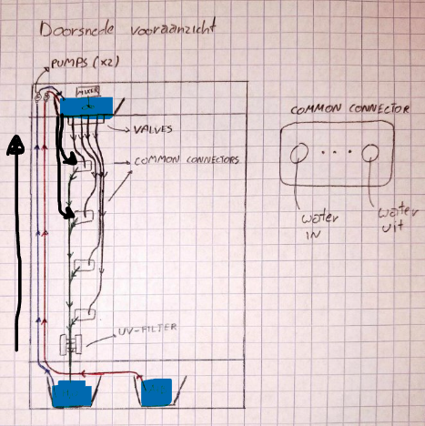

# Watersysteem
## Plan

Het systeem bestaat uit onderstaande componenten, aan elkaar gekoppeld:

- **Reservoirs**:
1 waterreservoir & 1 voedingsstofreservoir. Uiteindelijk wordt het gerecycleerde water uit het systeem teruggebracht in dit waterreservoir.  
Beide reservoirs worden aangevuld door een klep te openen aan de kast en hebben een sensor om de hoogte van de vloeistof op te meten.

- **Pompen**:
1 pomp voor het water omhoog te pompen en 1 pomp voor de voedingsstof omhoog te pompen.

- **Mengreservoir**:
Hierin worden de voedingsstoffen gemengt met het water.  
Dit reservoir bevat dus een mixer, eventuele sensoren om de concentratie voedingsstoffen te meten en een sensor om de hoogte van de vloeistof op te meten.

- **Ventielsysteem**:
Dit bevat zoveel ventielen als er bevestigingsplaatsen zijn voor de plantenmodules. Het laat toe om per module water te voorzien, eventueel telkens met eigen verhoudingen van voedingsstoffen.

- **Common connector**:
Deze aansluitingen zijn de verbinding tussen het interne watersysteem en de plantenmodules. Hiermee wordt eveneens de stroom doorgegeven.  
Er is een verbinding om het water naar de plantenmodule te brengen. Ook is er een retourverbinding om de wateroverschot te recycleren.

- **UV-filter**:
Het gerecycleerde water passeert door een UV-filter om algengroei te voorkomen. Hierna stroomt het verder naar het waterreservoir.

## Reservoirs

We hergebruiken enkele van de bloembakken als reservoir. Deze zijn ruim genoeg en kunnen makkelijk geïntegreerd worden in het ontwerp.

## Sensoren and Actuatoren

### Waterpomp

De [waterpomp](https://www.tinytronics.nl/nl/mechanica-en-actuatoren/motoren/pompen/waterpomp-12v) heeft een maximale spanning van 12VDC en gebruikt ~400mA (= 4,8W). Het heeft een maximale opvoerhoogte van 3m en aanzuighoogte van 1,5m. Deze is geschikt voor slangen met ongeveer 6mm binnendiameter.

### Magneetventiel

Het [magneetventiel](https://www.tinytronics.nl/nl/mechanica-en-actuatoren/solenoids/magneetventielen/magneetventiel-normaal-gesloten-12v-dc-nylon-6mm) heeft een maximale spanning van 13VDC (12VDC aangeraden) met een gemiddeld stroomverbruik van ~300mA (= 3,6W). Deze is geschikt voor slangen met 6mm binnendiameter en is normaal gesloten (NC).

### Mixer

Zie word document voor opties.

### NO3- Sensor

De [NO3- Sensor](http://www.measureteq.com/electrode-and-sensor/ion-selective-electrode/ise-2922-no3-nitrate-ion-selective-electrode.html) wordt aangesloten met een BNC-connector.

### Ca2+ Sensor

De [Ca2+ Sensor](http://www.measureteq.com/electrode-and-sensor/ion-selective-electrode/ise-2923-calcium-ion-selective-electrode-ise.html) wordt aangesloten met een BNC-connector.

### K+ Sensor

De [K+ Sensor](http://www.measureteq.com/electrode-and-sensor/ion-selective-electrode/ise-2920-potassium-ion-selective-electrode.html) wordt aangesloten met een BNC-connector.

### UV licht

Deze moet een golflengte hebben tussen de 254-265nm.

### Waterhoogte

[Capacitieve waterhoogte sensoren](https://www.tinytronics.nl/en/sensors/liquid/water-level-sensor) kunnen gebruik worden, maar er moet opgepast worden aangezien de concentratie ionen en pH invloed hebben op de geleidbaarheid van het water. Hierdoor hangt de gelezen waarde niet enkel van de hoogte af, maar ook van de concentratie ionen en de pH van het water.

Zie word document voor meerdere opties

## Common Connector

De common connector heeft 2 wateraansluitingen: WATER IN en WATER UIT. Deze worden elk voorzien met Quick-disconnects om makkelijk nieuwe plantenbakmodules aan te sluiten of te verwijderen.