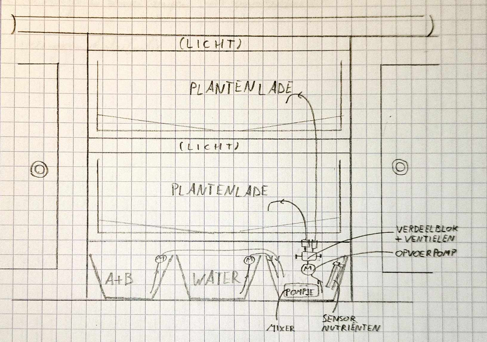
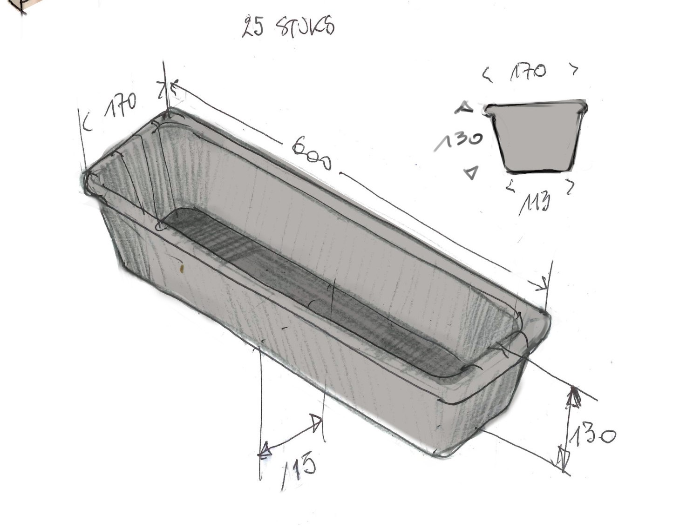
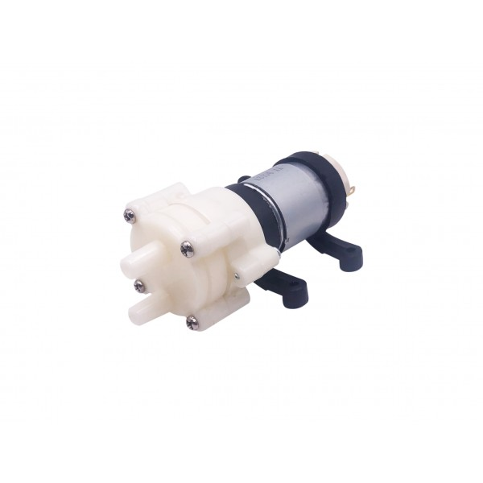
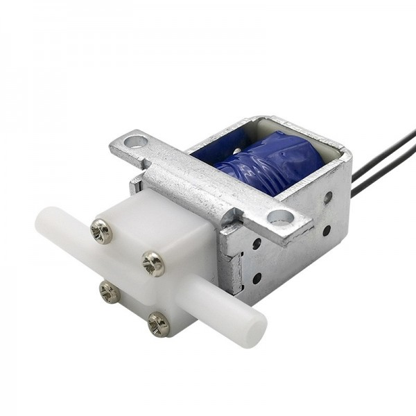
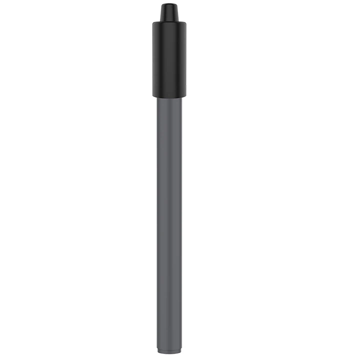
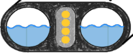

# Watersysteem
## Plan

Het systeem bestaat uit onderstaande componenten, aan elkaar gekoppeld:

- **Reservoirs**:
1 waterreservoir & 1 voedingsstofreservoir. Uiteindelijk wordt het gerecycleerde water uit het systeem teruggebracht in dit waterreservoir.  
Beide reservoirs worden aangevuld door een klep te openen aan de kast en hebben een sensor om de hoogte van de vloeistof op te meten.
We zoeken ook voor een oplossing om het water en de voedingstoffen voldoende te circuleren zodat het niet blijft stilstaan en er geen geurtjes zullen ontwikkelen.

- **Pompen**:
2 pompen om het water en de voedingstoffen naar het mengreservoir over te brengen.

- **Mengreservoir**:
Hierin worden de voedingsstoffen gemengd met het water.  
Dit reservoir bevat dus een mixer, eventuele sensoren om de concentratie voedingsstoffen te meten en een sensor om de hoogte van de vloeistof op te meten.

- **Pompsysteem**
Nadat het water gemixt is in het mengreservoir wordt het omhoog gepompt naar de gewenste plantenlade. We gebruiken per lade een pompje. Dit lijkt voordeliger dan een verdeelblok en ventielen op deze kleine schaal.

- **Common connector**:
Deze aansluitingen zijn de verbinding tussen het interne watersysteem en de plantenmodules. Hiermee wordt eveneens de stroom doorgegeven.  
Er is een verbinding om het water naar de plantenmodule te brengen. Ook is er een retourverbinding om de wateroverschot te recycleren.

- **UV-filter**:
Het gerecycleerde water passeert door een UV-filter om algengroei te voorkomen. Hierna stroomt het verder naar het waterreservoir.

## Reservoirs

We hergebruiken enkele van de bloembakken als reservoir. Deze zijn ruim genoeg en kunnen makkelijk geïntegreerd worden in het ontwerp.

## Sensoren en Actuatoren

### Waterpomp

De [waterpomp](https://www.tinytronics.nl/nl/mechanica-en-actuatoren/motoren/pompen/waterpomp-12v) heeft een maximale spanning van 12VDC en gebruikt ~400mA (= 4,8W). Het heeft een maximale opvoerhoogte van 3m en aanzuighoogte van 1,5m. Deze is geschikt voor slangen met ongeveer 6mm binnendiameter.

### Magneetventiel
(Deze zullen we niet meer gebruiken in het keukenmodel)

Het [magneetventiel](https://www.tinytronics.nl/nl/mechanica-en-actuatoren/solenoids/magneetventielen/magneetventiel-normaal-gesloten-12v-dc-nylon-6mm) heeft een maximale spanning van 13VDC (12VDC aangeraden) met een gemiddeld stroomverbruik van ~300mA (= 3,6W). Deze is geschikt voor slangen met 6mm binnendiameter en is normaal gesloten (NC).

Aandachtspunt: De spoel moet altijd naar boven gericht zijn, zie datasheet!

### Mixer

Er zijn verschillende opties voor watercirculatie:

- **Dompelpomp**  
  - Voordelen: Sterke circulatie  
  - Nadelen: Kan schuim of turbulentie veroorzaken  

- **Luchtpomp + luchtsteen**  
  - Voordelen: Zachte menging, weinig energieverbruik  
  - Nadelen: Lichte menging  

- **Mechanische mixer**  
  - Voordelen: Efficiënt mengen zonder veel turbulentie  
  - Nadelen: Mechanisch => onderhoud nodig  

We kozen voor een luchtpompje bij de reservoirs beneden. Dankzij een luchtsteen zal het water voldoende gecirculeerd worden.

Voor het reservoir kozen we een aquariumpompje. Dit heeft niet veel water nodig om een voldoende turbulente stroom te voorzien die het water mengt. Dit pompje sturen we aan op basis van de hoogte in dit bovenste reservoir.

### NO3- Sensor

De [NO3- Sensor](http://www.measureteq.com/electrode-and-sensor/ion-selective-electrode/ise-2922-no3-nitrate-ion-selective-electrode.html) wordt aangesloten met een BNC-connector.

### Ca2+ Sensor

De [Ca2+ Sensor](http://www.measureteq.com/electrode-and-sensor/ion-selective-electrode/ise-2923-calcium-ion-selective-electrode-ise.html) wordt aangesloten met een BNC-connector.

### K+ Sensor

De [K+ Sensor](http://www.measureteq.com/electrode-and-sensor/ion-selective-electrode/ise-2920-potassium-ion-selective-electrode.html) wordt aangesloten met een BNC-connector.

### Uitlezen van de chemische sensoren
Dit gebeurt met een ADC die vorig jaar reeds ontworpen is. We moeten nog op zoek naar het ontwerp van dit bordje.

### UV licht

Een gebruiksklare oplossing is zeer duur en niet direct beschikbaar. We zouden een eigen UV-filter kunnen maken door de tube langsheen een UV-ledstrip te laten gaan.  
De effectiviteit van deze filter zou zelfs beter kunnen zijn als we de leds ook boven het waterreservoir hangen. Op deze manier komt het water gedurende een langere periode in contact met het UV-licht.   

Deze moet een golflengte hebben tussen de 254-265nm.

We vonden ook enkele interessante lampen met G23 connectors. Bijvoorbeeld een UVC Phillips 9W TC-S G23 zou hiervoor geschikt zijn. We voeren nog wat onderzoek uit hiernaar.

Er zijn ook oplossingen beschikbaar door zelf een zandfilter te maken. Deze moet wel regelmatig vervangen worden en kost mogelijks veel geld.

Uiteindelijk vonden we enkele UV-lampen die in aquariums worden gebruikt. Deze kunnen we makkelijk toepassen in ons watersysteem.

### Waterniveau Sensor

Er zijn verschillende opties voor waterniveau meting:

| Kenmerk | Waterniveau Sensor | DFRobot Contactloze Sensor | Ultrasone Sensor |
|---------|--------------------|--------------------------|-----------------|
| Meetprincipe | Weerstand (direct contact) | Capacitief (contactloos) | Ultrasoon geluid |
| Contactloos? | Nee | Ja | Ja |
| Output | Analoog | Digitaal | Analoog |
| Meetbereik | Verschillende niveaus | Alleen "aan/uit" detectie | 2-450 cm |
| Nauwkeurigheid | Afhankelijk van vloeistofconductiviteit en corrosie | Betrouwbaar, maar geen niveau-indicatie | 3mm |
| Geschikt voor alle vloeistoffen? | Nee, alleen geleidende vloeistoffen | Ja | Ja |
| Corrosiegevoelig? | Ja | Nee | Nee |
| Prijs | Goedkoop | Duurder | 1-3 euro |
| Toepassing | Waterniveau meten | Vloeistofniveau detecteren zonder contact | Zeer nauwkeurig vloeistofniveau opmeten |

Zie onderstaande links voor verschillende sensoren:
- [Waterniveau Sensor](https://www.tinytronics.nl/nl/sensoren/vloeistof/waterniveau-sensor)
- [DFRobot Contactloze Sensor](https://www.tinytronics.nl/nl/sensoren/vloeistof/dfrobot-gravity-contactloze-vloeistofniveau-schakelaar-sensor)
- [Ultrasone Sensor](https://www.tinytronics.nl/en/sensors/distance/ultrasonic-sensor-hc-sr04)

We kozen voor de ultrasone sensor. De waterniveausensor was ook een goede keuze maar leek ons toch net niet helemaal geschikt. Beiden hebben nadelen en voordelen.

## Common Connector

De common connector heeft 2 wateraansluitingen: WATER IN en WATER UIT. Deze worden elk voorzien met Quick-disconnects om makkelijk nieuwe plantenbakmodules aan te sluiten of te verwijderen.

# Randmateriaal

## Tubes

Overal hebben we aansluitingen met een binnendiameter van 6mm. We maken een inschatting van de lengte tube eens we de kast hebben opgemeten hebben.

## Aansluitmateriaal

- Teflon
- Klemring: 2 per common connector, 2 per pompje, 2 per ventiel

# TODO's

- UV-lamp verder onderzoeken
- Implementatie kast onderzoeken
- ADC onderzoeken